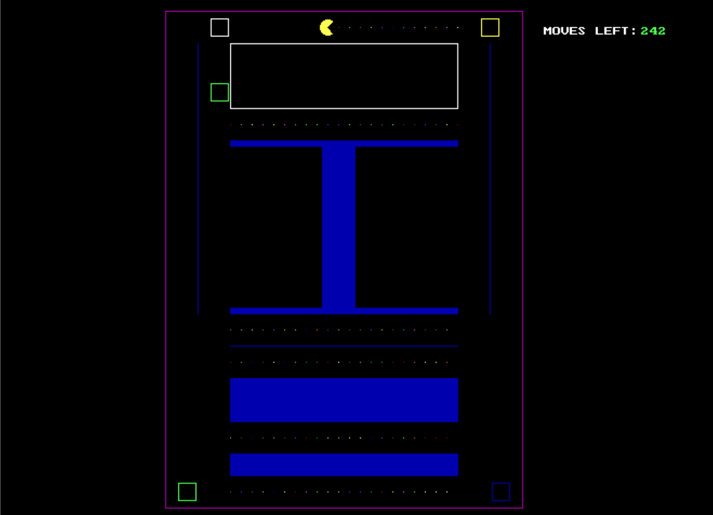

# Pacman

## Developed in ***C++*** language
## Using Turbo C++ and IDE Compiler

### Implemented using built-in ***Graphics Library*** to perform various motion effects and and movements and screen rendering. 

#### To play the game simply download Turbo C++ And build,complile and run .

## Logic 
* ### The main screen has a Layout (In the image above) which is made using Rectangles and Lines with the different coordinates.
* ### The representation of pac-man is made using a Sector (A sector is part of a disk enclosed by two radii and an arc)
* ### The representation of monsters or Traps (whatever you prefer) is implemented using a square.
* ### When the pac-man touches the square(monster) the game gets over.
* ### The movement process of pac-man - When the user presses an arrow key the pac-man is moved accordingly by incrementation or decrementation of it's coordinate (using if else and increment/decrement operator) and the pac-man at the previous position is deleted.
* ### And similarly the coordinates of the monsters are also changed but using _random function_ to randomize the movement of monsters.
* ### So after every interval(let's say 1 milli-second)if the user presses a an arrow key then pac-man's coordinate will change accordingly and irrespective of the key pressed every time coordinates of the monsters are gonna change. 
* ### Also there's a restriction on the number of moves which is a simple condition that is the number of times the arrow key pressed is greater than the number of moves then end the game.
* ### And that's all...the pac-man moves when the keys are pressed and monsters move after every interval irrespective of the key pressed and it looks like the pac-man moves on our command and monsters are moving randomly and following you.
* ### Also someone can also implement a path-finding algorithm for the monster to find pac-man but that will make the game much more difficult.
